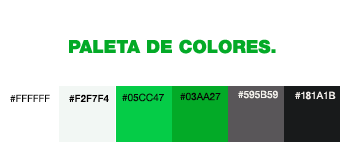

##PROYECTO FINAL.

Desarrollare proyecto en base a tema de página web de Vida Sana.

###Estructura de directorio:

	proyecto final MP
	 |
	 |__ assets
	 |	|__ css
	 |	|  |__ styles.css
	 |	|
	 |	|__ js
	 |	|  |__ scripts.js
	 |	|
	 |	|__ img
	 |	|  |__ todas las imagenes 
	 |	|
	 |	|__ fonts
	 |	|  |__ fuentes
	 |	|
	 |	|__ videos
	 |     |__ todos los videos
	 |	
	 |__ index.html
	 |
	 |__ Conocenos.html
	 |
	 |__ Nutrirecetas.html
	 |
	 |__ blog.html
	 |
	 |__ Nutrientes.html
	 |
	 |__ contacto.html

###Objetivos de interfaz (IU):

- Que sea responsiva, que la presentación en móvil sea muy llamativa ya que 	quienes tienen este estilo de vida son más propensos a usar este medio.
- La página tendrá una barra de navegación siempre visible al usuario.
- Botones
- Iconos
- Imágenes
- Paleta de Colores

###Objetivos de usuario (UX):

Que sea una página simple, pero con información precisa y util, facil de navegar, entretenida e interactiva con el usuario, que su foco principal sea dar noticas relevantes y orientación.

###Requerimientos del sitio:

Página de vida sana enfocada en las personas vegetarianas, veganas y celiacas de la comuna.

Con recetas para cada grupo y lugares donde puedan comprar y/o comer dentro de la comuna.

Destacar nutrientes importantes y donde encontrarlos recomendado por nutricionistas especializados.

Blog con articulos y noticias de importancia para ellos en la comuna.

Página de contacto para resolver inquietudes y sugerencias.

###El layuot del sitio:

El layout estara mezclado entre magazine y blog.